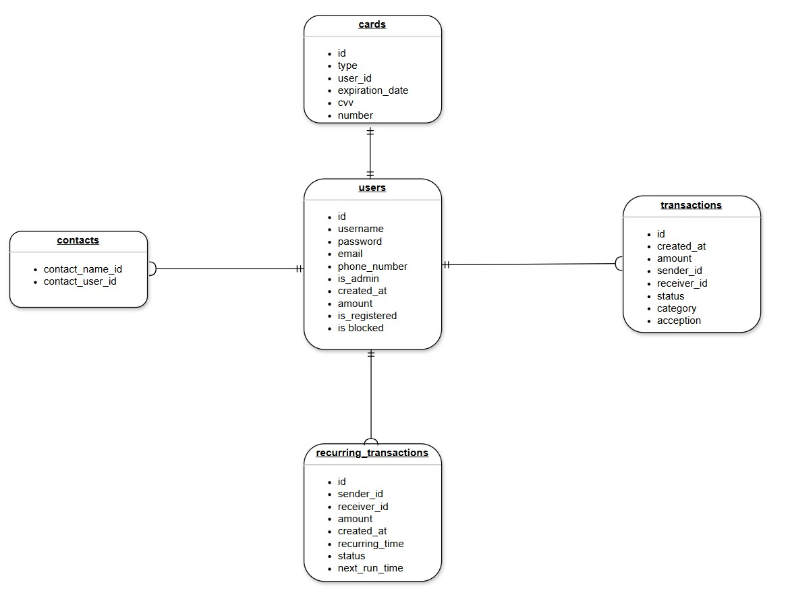
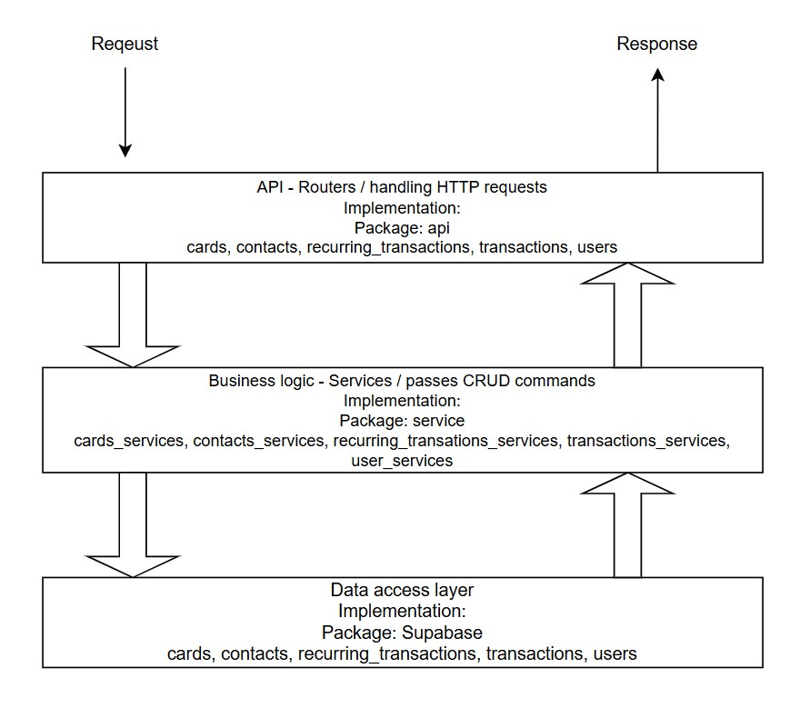

# Virtual-Wallet

## 1.Project discription
- User Management: Enables user registration, login, profile management, and admin functions like user authorization and account blocking.
- Transaction Handling: Supports money transfers between users and from bank accounts, including recurring transactions and category-based tracking.
- Card Management: Allows users to register, update, and delete credit/debit cards, enabling fund transfers to and from their virtual wallets.
- Search and Contact Features: Provides functionality to search users by username, email, or phone number and manage contact lists for easy transactions.
- Admin Capabilities: Admins can approve registrations, block/unblock users, view and manage transactions, and deny pending transactions, ensuring smooth operation and security.

## 2.Database

## 3.Architecture Diagram

## 4.Hosting

How to interact with the API:
- To run the FastAPI project locally, use Uvicorn as the server. Navigate to your project directory in the terminal and execute the following command: uvicorn main:app --reload. This command will start the FastAPI server in development mode with automatic reloading enabled. The application will be accessible at the URL:
http://127.0.0.1:8000. By visiting this URL in your web browser, you can interact with your FastAPI application using SWAGGER.

- Once the server is running, you can find the documentation for each endpoint in the ReDoc interface at: http://127.0.0.1:8000/redoc

[DB -> Supabase](https://supabase.com/dashboard/project/lcrwokhdqhyvbcjmuedq/editor/29471?sort=id%3Aasc)

## 5. Technologies implemented:
- Python
- Supabase
- FastAPI